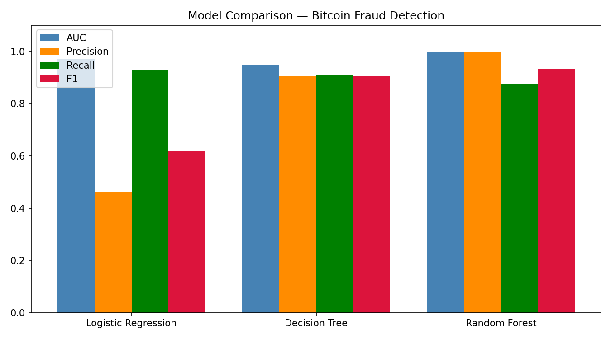
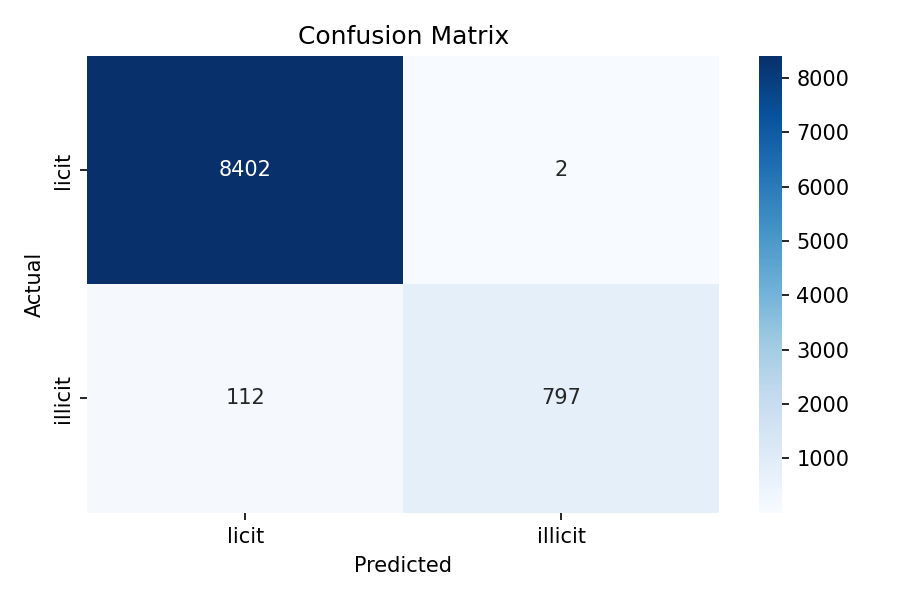
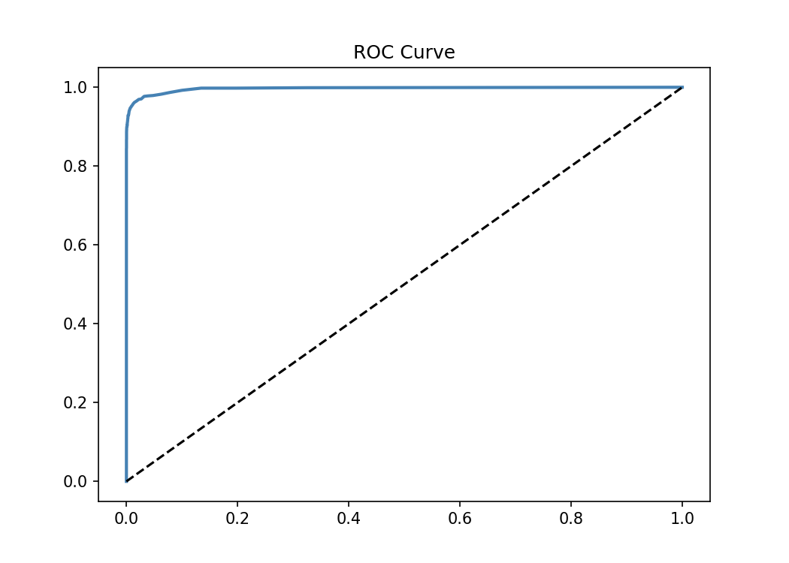
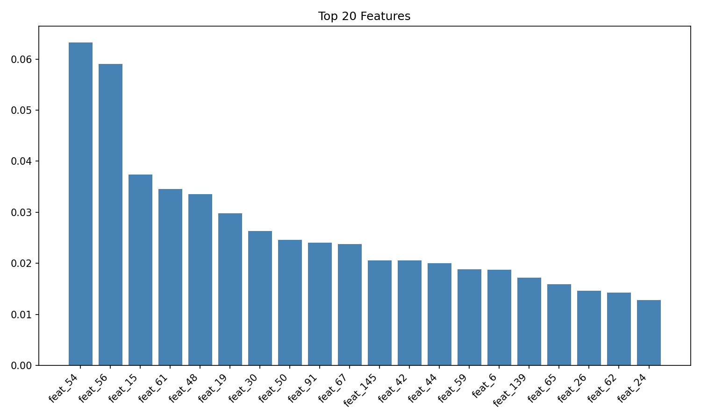

Graph enhanced machine learning# Bitcoin Fraud Detection — Blockchain Analytics

Detecting illicit transactions in the Bitcoin network using graph-enhanced machine learning on the Elliptic dataset.

## Results

| Metric | Score |
|--------|-------|
| Accuracy | 99% |
| Precision (illicit) | 100% |
| Recall (illicit) | 88% |
| AUC-ROC | 0.997 |

## Model Comparison

| Model | AUC | Precision | Recall | F1 |
|-------|-----|-----------|--------|----|
| Logistic Regression | 0.9702 | 0.4638 | 0.9307 | 0.6191 |
| Decision Tree | 0.9487 | 0.9056 | 0.9076 | 0.9066 |
| **Random Forest** | **0.9966** | **0.9975** | **0.8768** | **0.9333** |

Random Forest was selected for its near perfect precision. In an investigative context,
every flag must be actionable. Logistic Regression's 46% precision means more than half
its alerts are false alarms — operationally unacceptable when analyst time is the bottleneck.

## Dataset

The [Elliptic Data Set](https://www.kaggle.com/datasets/ellipticco/elliptic-data-set) maps 203,769 Bitcoin transactions to real entities — exchanges, wallets, darknet markets, scams, ransomware, and Ponzi schemes. Download from Kaggle and place in `elliptic_bitcoin_dataset/`.

## Methodology

Started with unsupervised anomaly detection using Isolation Forest on raw transaction features. 
The model failed to detect illicit transactions, which pointed to a structural problem: the 167 features are anonymized, 
and without network context, 
no statistical signal separates fraud from legitimate activity.

Rebuilt the pipeline using the transaction graph. Constructed the full Bitcoin network from 234,355 edges, computed degree centrality for each transaction node, and fed that into a class balanced Random Forest. 
The class weighting corrects for the 9:1 licit/illicit imbalance without discarding data.

## Key Finding

Graph structure matters. Isolation Forest on raw features: 0% recall. Graph-enhanced Random Forest: 
88% recall, 100% precision, AUC 0.997. The failure of the first model is itself the finding 
it explains why blockchain fraud detection requires network-aware methods.

## Visualizations

## Phase 2

Graph Neural Network implementation on the same dataset, following the Elliptic/MIT paper methodology.
## Phase 2: Graph Neural Network

A 2-layer Graph Convolutional Network (GCN) implemented using PyTorch Geometric, operating directly on the full Bitcoin transaction graph of 203,769 nodes and 234,355 edges.

Initial training without class weighting achieved 53% recall — the same class imbalance problem as the unweighted Random Forest. After applying class-weighted loss and extending to 200 epochs, recall improved to 91% with an AUC of 0.9656.

| Model | AUC | Precision | Recall | F1 |
|-------|-----|-----------|--------|----|
| Logistic Regression | 0.9702 | 0.46 | 0.93 | 0.62 |
| Decision Tree | 0.9487 | 0.91 | 0.91 | 0.91 |
| Random Forest | 0.9966 | 1.00 | 0.88 | 0.93 |
| GNN untuned | 0.9519 | 0.90 | 0.53 | 0.67 |
| GNN class-weighted | 0.9656 | 0.52 | 0.91 | 0.66 |

The GNN achieves higher recall than Random Forest but lower precision. In operational terms: Random Forest is the right choice when every investigator flag must be actionable. The GNN is the right choice when catching maximum fraud volume is the priority and the team has capacity to filter false positives.

## Author

Salha Qahl
